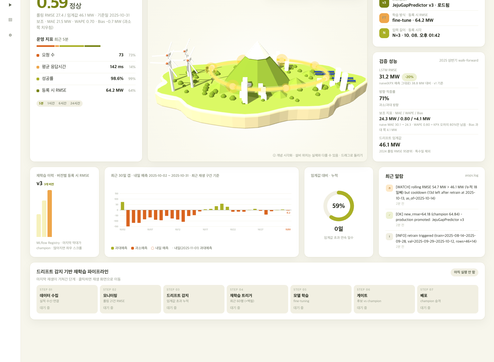
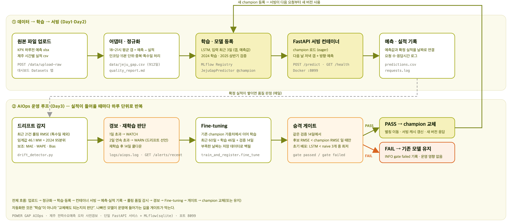

# POWER GAP AIOps — 제주 전력수요예측 오차 사전경보

> SKALA 4기 「모델 서빙 및 AIOps 구성」 조별 미니 프로젝트 (2026-10-08)
> 전력거래소(KPX)의 **제주 하루전 수요예측이 내일 저녁에 몇 MW, 어느 방향으로 빗나갈지**를 하루 먼저 알려주고,
> 그 예측 모델이 시간이 지나도 계속 맞도록 **드리프트 감지 → 재학습 → 게이트 → 승격**을 자동으로 돌리는 서빙 파이프라인입니다.

<p align="center"></p>

---

## 1. 무엇을 하는 서비스인가

| 질문 | 답 |
|---|---|
| 예측 대상 | 제주 **18~21시 평균 갭** `GapMW = KPX 하루전 예측 − 실제 수요`. 음수 = 과소예측(실제가 더 큼) |
| 입력 | 최근 3일의 확정 갭과 KPX 예측값 `(GapMW, ForecastMW) × 3` |
| 출력 | 다음 날 저녁 갭 한 값(MW) + 방향 라벨(under / near_zero / over) |
| 왜 필요한가 | 2024~2025년 731일 중 **74.6%가 과소예측**, 평균 −19.8 MW. 빗나가는 만큼 운영자는 예비력을 "모르고" 들고 있어야 한다 |
| 모델 | 소형 LSTM(16) 한 층. 수업에서 받은 HAIC 주가 실습 파이프라인(FastAPI + MLflow + LSTM)을 전력 도메인으로 치환. **모델 고도화가 목적이 아니라 데이터·운영 기준·화면의 치환이 목적** |
| 운영 | FastAPI 단일 서비스, MLflow Registry(alias `champion`), Docker 컨테이너(포트 8099), 대시보드 4탭 |

### 검증된 효과 (2025년 walk-forward, 하루 앞 예측)

"공식 예측 그대로"는 KPX 예측을 보정 없이 썼을 때 남는 오차, "보정 후"는 KPX 예측에 LSTM 예측 갭을 반영했을 때 남는 오차입니다.

| 2025 하반기 184일 | 공식 예측 그대로 | 보정 후 | 감소 |
|---|---|---|---|
| **60 MW 이상 빗나간 날** | 39일 | 19일 | **−51%** |
| 40 MW 이상 빗나간 날 | 76일 | 45일 | −41% |
| 40 MW 이상인 날의 평균 오차 | 69.2 MW | 44.1 MW | −36% (방향 적중 87%) |
| 전체 RMSE | 49.8 MW | 37.7 MW | −24% |
| 치우침 Bias (예측−실제 평균) | +17.5 MW | +2.3 MW | 쏠림 13%만 남음 |

상반기(181일)도 같은 방향: RMSE 38.8 → 31.2 MW(−20%), Bias +19.3 → +4.1 MW, WAPE 0.80.
대표 사례 2025-10-04: KPX 699 MW, 실제 816 MW(−117). 전날 저녁 모델이 −75를 예고해 보정 수요 774, 남은 오차 42 MW(64% 제거).
근거 그림: [`docs/screenshots/10_근거_60MW이상_빗나간날_39to19.png`](docs/screenshots/10_근거_60MW이상_빗나간날_39to19.png), [`11_근거_100MW이상_11일_사례_10월4일.png`](docs/screenshots/11_근거_100MW이상_11일_사례_10월4일.png)

> 이 수치는 사후 예측 검증 결과입니다. 비용 환산은 예비력 단가를 곱하면 되지만 단가는 KPX 내부 값이라 넣지 않았습니다.

---

## 2. 아키텍처

<p align="center"></p>

```
원본 업로드(xlsx·csv) → 어댑터(jeju_gap.csv) → 학습·MLflow Registry(@champion) → FastAPI 컨테이너
→ 예측·실적 기록(predictions.csv) → 롤링 21건 품질 감시 → 경보(aiops.log) → Fine-tuning → 게이트 → champion 교체(또는 유지)
```

자동화한 것은 "학습"이 아니라 **"교체해도 되는지의 판단"** 입니다. 나빠진 모델이 운영에 들어가는 길을 게이트가 막습니다.

---

## 3. 빠른 시작

### 로컬 (Python 3.11)

```bash
pip install -r requirements.txt
python data/prepare_power_gap.py --seed-upload     # data/raw 원본 → data/jeju_gap.csv + 품질 보고서, uploads 시드
python scripts/train_baseline_v1.py                # 2024 스케일러·LSTM 학습, 2025 상반기 검증, thresholds.json
python serving_app/train_and_register.py           # MLflow 기록 + 게이트 통과 시 JejuGapPredictor@champion 승격
MODEL_SOURCE=mlflow uvicorn serving_app.main:app --host 0.0.0.0 --port 8077
```

대시보드 http://localhost:8077/ · API 문서 http://localhost:8077/docs

### 컨테이너 (포트 8099)

```bash
docker compose -f serving_app/docker-compose.yml up --build
```

이미지 빌드 시점에 정규화 → 학습 → 등록까지 끝나는 자기 완결형 이미지입니다. `/health`가 `model_loaded=true`이면 시연을 시작할 수 있습니다.

### 시연 시나리오 (드리프트 → 재학습 → 승격)

```bash
curl -s -X POST localhost:8077/predict/reset                                  # 예측 이력·누적 일수 초기화 (모델은 유지)
python scripts/simulate_drift.py --url http://localhost:8077 --start 2025-09-01 --end 2025-10-31
```

두 달을 하루씩 재생하면 9-28과 10-13에 드리프트가 선언되고, 두 번 모두 게이트를 통과해 v1 → v2 → v3로 승격됩니다. 대시보드 Simulation 탭에서 같은 구간을 재생해도 됩니다. 로그 예시는 [`docs/screenshots/05_aiops_log_WATCH_WARN_INFO_OK.png`](docs/screenshots/05_aiops_log_WATCH_WARN_INFO_OK.png).

---

## 4. 운영 설계 (드리프트·재학습·게이트)

| 항목 | 값 | 근거 |
|---|---|---|
| 품질 지표 | 최근 **21건** 확정 실적의 롤링 RMSE (MW) | 영업일 기준 한 달. 특수일(연휴 ±1일)은 창에서 제외, 포함값도 로그에 기록 |
| 드리프트 임계값 | RMSE **46.1 MW** 그리고 MAE **36.8 MW** | 정상이었던 2024년에서 같은 방식으로 잰 롤링 RMSE·MAE의 95분위 (특수일 33일 제외). `serving_app/models/thresholds.json`, `scripts/recompute_thresholds.py` |
| 드리프트 판정 규칙 | **RMSE와 MAE가 둘 다** 각자 임계값 초과 (`DRIFT_RULE=rmse+mae`, 기본) | RMSE는 하루 큰 오차(노이즈)에 끌려가므로, 이상치에 둔감한 MAE까지 넘을 때만 진짜 악화로 본다. `DRIFT_RULE=rmse`면 예전처럼 RMSE 하나 |
| 드리프트 점수 | 롤링 RMSE ÷ 46.1 | 1 초과 = RMSE 기준 초과. 정확도가 아님 |
| 재학습 조건 | **2일 연속** 초과 | 1일째 `[WATCH]`, 2일째 `[WARN]`. 하루 튄 것으로는 재학습하지 않음 |
| 쿨다운 | 재학습 후 **14일** | 승격/차단 무관. 새 모델이 자리 잡기 전 연쇄 재학습 방지 |
| Fine-tuning | 최근 60행 = 학습 `[D-60, D-15]` 46일 + 검증 `[D-14, D-1]` | champion 가중치에서 이어 학습(lr 1e-4, 10 epoch). 이력이 짧으면 `data/jeju_gap.csv`에서 백필 |
| 재학습 게이트 | 같은 검증 14일에서 **후보 RMSE < champion RMSE**(개선폭 > `GATE_MIN_GAIN_PCT`, 기본 0) **그리고 후보 MAE < champion MAE** | 통과 시 alias 이동 + 서빙 캐시 무효화. 실패 시 `[INFO] gate failed`, 기존 유지. 드리프트 선언과 승격은 별개 조건이라 드리프트가 떠도 후보가 더 낫지 않으면 교체하지 않음. 14일 표본 잡음을 걸러내려면 `GATE_MIN_GAIN_PCT=3`처럼 최소 개선폭을 둔다 |
| 초기 배포 게이트 | 검증 RMSE < naive 3개(zero / train_mean / persistence) 중 최저 **그리고** 검증 MAE < naive 중 최저 MAE | RMSE 31.2 < 33.7, MAE 24.3 < 25.8 MW 통과 |
| 보조 지표 | MAE · WAPE · Bias | 판정은 RMSE 하나. WAPE = Σ\|실제−예측\| ÷ Σ\|실제\|(naive = 1.00, "KPX 오차 중 남은 비율"), Bias = 치우침. 대시보드와 `GET /metrics/validation`에 표시 |
| 방향 라벨 | under ≤ −33.9 / over ≥ −7.8 MW | 2024년 갭 분포 3등분 경계. 갭이 구조적으로 음수라 0을 경계로 쓰면 라벨이 무의미 |

로그 한 바퀴: `[WATCH] rolling RMSE 46.2 > 46.1, MAE 38.8 > 36.8 (누적 1일째)` → `[WARN] drift detected - triggering retrain` → `[INFO] retrain triggered (train=…, val=…, rows=46+14)` → `[OK] new_rmse=50.0 (champion 50.1, +0.2% > min 0%), mae 40.9 < 41.2 - production promoted: v2`. 게이트 실패는 `[INFO] gate failed: … [rmse ok / mae x] - keeping current champion`

---

## 5. 데이터

| 파일 | 내용 |
|---|---|
| `data/raw/` | KPX 제주 하루전 예측 `pssJeju_2024/2025/2026.xlsx`(24열·15분 96열 두 형식), 공공데이터포털 `한국전력거래소_시간별 제주전력수요_*.csv` 분기 덤프 |
| `data/prepare_power_gap.py` | 전처리 어댑터. CP949/UTF-8 BOM, 천 단위 쉼표, NFD 파일명, 중복 파일(수정 시각이 최신인 파일 우선), 18~21시 누락 처리 → `jeju_gap.csv`(`Date,GapMW,ForecastMW`), `quality_report.md`, `excluded_dates.json`, `unmatched.json` |
| `data/jeju_gap.csv` | 912일 (2024-01-01 ~ 2026-06-30). 실적은 분기 단위로 공개되어 2026-07 이후는 예측만 존재 |
| `data/features.py` | `GapScaler`(2024에만 fit), `build_sequences`(연속 N일 창), 분할 상수 (학습 2024 / 검증 2025 상반기 / 최종 2025 하반기) |
| `data/metrics.py` | RMSE·MAE·WAPE·Bias·방향 적중률, naive 기준 모델 3개, 롤링 RMSE |
| `data/holidays.py` | 2024~2026 공휴일·연휴 달력 (드리프트 창의 특수일 제외용) |

대시보드 Datasets 탭이나 `POST /data/upload-raw`에 원본 두 종류를 그대로 올리면 서버 안에서 어댑터가 돌아 등록됩니다.

---

## 6. API (20개)

| 영역 | 엔드포인트 | 내용 |
|---|---|---|
| 예측 | `POST /predict` | `target_date` + 연속 3일 `[{date, gap_mw, forecast_mw}]` → `predicted_gap_mw`, `direction`, `model_version`. 날짜 누락·비연속·`forecast_mw ≤ 0`·NaN은 **422** |
| | `POST /predict/replay` | 과거 이력을 날짜순 재생(예측 → 실적 연결 → 품질 판정 → 재학습) |
| | `GET /predict/next` · `GET /predict/history` · `POST /predict/reset` | 내일 예측(기록 없음) · 기록 조회 · 상태 초기화 |
| 데이터 | `POST /data/upload-raw` · `POST /data/upload` | 원본 xlsx·csv 업로드(서버 전처리) · 정규화 CSV 업로드 |
| | `GET /data/status` · `/data/history` · `/data/quality` · `/data/raw-files` · `/data/uploads` | 등록 상태·구간 조회·품질 보고서·파일 목록 |
| 운영 | `GET /health` | 모델 로딩·버전·입력 길이·임계값 |
| | `GET /metrics/summary?window=300` | 요청 수·응답시간·성공률, 버전별 RMSE, 드리프트 점수·누적 일수·보조 지표 |
| | `GET /metrics/validation` | 저장된 평가의 모델별 RMSE·MAE·WAPE·Bias·방향 |
| | `GET /alerts/recent` · `GET /logs` · `GET /logs/{filename}` | 알람 피드(aiops.log 파싱) · 로그 파일 |
| 모델 | `GET /models/versions` · `GET /models/current` | 레지스트리 버전 목록(모드·RMSE·게이트) · 현재 champion |

전체 계약은 `/docs`(Swagger) · `/openapi.json`. 요청·응답 예시: [`docs/screenshots/02_API_입력검증_200_vs_422.png`](docs/screenshots/02_API_입력검증_200_vs_422.png)

---

## 7. 대시보드

- **Dashboard**: 드리프트 점수·운영 지표, 제주 섬 3D(Three.js, 드리프트 시 송전 링이 빨갛게 변하고 한라산 위에 경고), 내일 예상 갭 배지, 현재 운영 모델, 검증 성능(RMSE·방향·MAE/WAPE/Bias), 버전별 RMSE, 최근 30일 갭, 임계값 대비 누적, 최근 알람, 파이프라인 7단계
- **Simulation**: 실제 이력/합성 시나리오 재생, 롤링 RMSE·초과 누적·재학습/승격 타일, 날짜별 표, 이벤트 표, 단건 예측, 초기화
- **Datasets**: 원본 업로드(서버 전처리), 정규화 CSV 업로드, 파일 목록, 품질 보고서
- **System**: 서버 상태, 임계값 근거, 재학습 이력, 로그 원문
- 라이트/다크 전환(`?theme=light|dark` 또는 레일 하단 버튼). 색은 멜론 팔레트 6색만 사용.

---

## 8. 평가 상세

<details>
<summary>변동 크기별 보정 효과 — 2025 하반기 (<code>docs/report_by_magnitude_final.md</code>)</summary>

| 실제 갭 크기 | 일수 | 방향 적중 LSTM | 보정 전 평균 \|갭\| | 보정 후 평균 \|잔차\| | 감소율 | RMSE naive → LSTM |
|---|---|---|---|---|---|---|
| \|갭\| < 40 | 108 | 69% | 18.0 | 17.5 | 2% | 21.1 → 22.5 |
| 40 ≤ \|갭\| < 60 | 37 | 78% | 50.1 | 33.4 | 33% | 50.5 → 39.6 |
| 60 ≤ \|갭\| < 100 | 29 | 97% | 77.3 | 45.4 | 41% | 78.1 → 49.7 |
| \|갭\| ≥ 100 | 10 | 90% | 116.6 | 79.7 | 32% | 117.4 → 88.0 |
| \|갭\| ≥ 40 (누적) | 76 | 87% | 69.2 | 44.1 | 36% | 73.4 → 52.2 |
| 전체 | 184 | 76% | 39.1 | 28.5 | 27% | 49.8 → 37.7 |

40 MW 미만인 평범한 날은 효과가 거의 없고, 40 MW를 넘는 날부터 효과가 납니다. 100 MW 이상(연휴·폭염)은 방향은 맞히지만 크기는 1/3만 줄입니다. 급변 첫날(예: 2025-10-03 −150 MW)은 놓치고 둘째 날부터 잡습니다.
</details>

<details>
<summary>입력 길이 N 실험 (<code>docs/seq_len_sweep.json</code>)</summary>

| N | 검증 RMSE | 최종 RMSE |
|---|---|---|
| 1 | 31.2 | 37.6 |
| 3 | 31.2 | 37.7 |
| 7 | 31.3 | 38.8 |
| 14 | 30.9 | 38.8 |
| 20 | 31.7 | 39.3 |

N=1~20 전부 시드 잡음 수준이라 **N=3**을 기본으로 둡니다(`SEQ_LEN`, 학습·서빙이 같은 값이어야 함).
</details>

---

## 9. 디렉터리

```
power-gap-forecast/
├── data/            prepare_power_gap.py(어댑터) · raw_readers.py · features.py · metrics.py · holidays.py · storage.py · jeju_gap.csv · raw/
├── scripts/         train_baseline_v1.py · evaluate_walkforward.py · report_magnitude.py · simulate_drift.py(이력 재생) · build_dataset.py
├── serving_app/     main.py · schemas.py · model_loader.py · state.py · evaluation.py · lstm_model.py · train_and_register.py · reqlog.py
│   ├── routers/     predict.py · data.py · metrics.py · health.py · logs.py
│   ├── monitoring/  drift_detector.py · retrain_trigger.py
│   ├── models/      scaler.pkl · jeju_gap_v1.keras · thresholds.json
│   ├── static/      index.html (대시보드) · vendor/three.min.js
│   └── Dockerfile · docker-compose.yml
└── docs/            eval_*.json · report_by_magnitude_*.md · seq_len_sweep.json · PROJECT_NOTES.md · screenshots/
```

`mlruns/`, `mlflow.db`, `logs/`, `data/uploads/`, `data/predictions.csv`는 실행 중 생성되므로 저장소에 포함하지 않습니다. 위 "빠른 시작" 두 스크립트를 돌리면 v1 champion이 만들어집니다.

---

## 10. 한계와 다음 단계

- **데이터 시점**: 공개 실적이 분기 단위라 지금은 과거 구간 재생입니다. 일별 실적 소스(EPSIS 등)를 붙이면 그대로 "진짜 내일" 예측이 되고 모델·파이프라인은 바꿀 게 없습니다.
- **공동 대응**: 같은 경보에 KPX·VPP/ESS·DR이 각자 최대로 반응하면 과잉 대응이 됩니다. 역할과 대응량을 나누는 구조는 다음 과제입니다.
- **비용 환산**: MW 단위까지만 검증했습니다. 예비력 단가 × 줄어든 MW가 절감액이지만 단가는 입력받아야 합니다.
- **운영 안정성**: 단일 워커·메모리 상태, 재학습 동기 실행. DB 영속화·비동기 재학습·권한·장애 복구는 후속.
- **사람 승인**: 현재는 게이트만 통과하면 자동 승격입니다. 중요한 결정에 사람 승인(human-in-the-loop)을 넣는 확장은 설계하지 않았습니다.

---

## 11. 팀

교수님이 주신 LSTM 파이프라인은 유지하고, 데이터·운영 기준·화면을 제주 전력 도메인으로 치환하는 일을 넷이 나눴습니다. 결과물은 하나의 파이프라인입니다.

| 이름 | 역할 |
|---|---|
| 김주오 | 데이터 수집·결합·품질 정리, 구현명세서 |
| 왕시훈 | 기획서·발표자료 제작, 발표자 노트 근거 정리 |
| 최인서 | PM, 대시보드 UI 설계·구현 |
| 신동범 | 파이프라인 코드 치환·검증, 컨테이너, 발표 |

데이터 출처: 한국전력거래소(일자별 발전계획용 수요예측, 제주), 공공데이터포털(시간별 제주전력수요).
